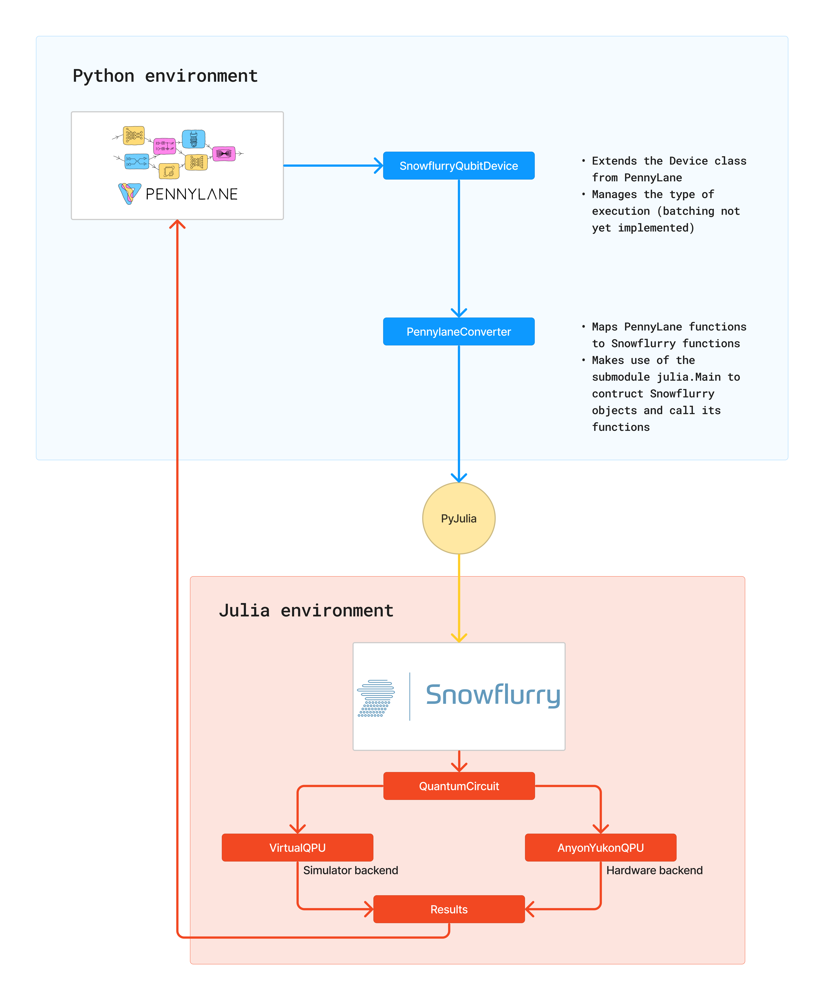

# pennylane-snowflurry

This is a [PennyLane](https://pennylane.ai/) plugin allowing to use Anyon Systems' API to run quantum circuits on their quantum computer.

This package makes use of dependencies such as PyJulia and PyCall to communicate with the Julia package [Snowflurry](https://snowflurry.org/).

## Project structure

As shown in the diagram below, this plugin is used in Pennylane as a [device](https://pennylane.ai/plugins/) named `snowflurry.qubit`. This device is defined by the class `SnowflurryQubitDevice`. It converts a PennyLane circuit into a Snowflurry circuit, thanks to packages like PyJulia that allow the communication between Python and Julia environments. The Snowflurry circuit can then be used with the available backends, either a simulator or real quantum hardware. The results are then converted back into PennyLane's format and returned to the user.



## Local installation

This plugin is available on PyPI, but it is recommended to install it locally with the following instructions.

You'll need to clone this repo and then install the dependencies, eighter with conda or pip.

### Conda

If you happen to have a conda distribution, you can use the environment.yml file to create a conda environment with most of the dependencies already installed.

Open a terminal and execute the following command:

`conda env create -f environment.yml`

or if you want it installed in a specific location (replace /path/to/env with the path you want):

`conda env create -f environment.yml -p /path/to/env`

You can then activate your environment as usual.

### Python

If you don't have a conda distribution, but have a python distribution, you can install the dependencies with pip.

`pip install -r requirements.txt`

### Julia

If you don't have Julia installed, you can download it from the [official website](https://julialang.org/downloads/).

### PyJulia and PyCall

PyJulia and PyCall are used to communicate between Python and Julia. At this point, PyJulia is already installed with either conda or pip, but you'll need to install PyCall in your Julia environment. To do so open a python terminal and execute the following commands:

```py
import julia
julia.install()
```

Alternatively, you could also install PyCall from the Julia REPL, but the previous method makes sure to build the package for your current python environment.

```julia
using Pkg
Pkg.add("PyCall")
```

### Plugin installation

The following command will install the plugin on your computer:

`pip install -e .`

### PennyLane and Snowflurry

After installing this plugin, makes sure you have working Snowflurry and PennyLane installations.

For PennyLane, we recommend that you install the latest version with pip:

`pip install git+https://github.com/PennyLaneAI/pennylane.git@master`

For Snowflurry, please refer to the [Snowflurry documentation](https://snowflurry.org).

### Running files and tests

To run the tests, you can use the following command from the root of the repo:

`python -m tests.test_pyjulia-snowflurry -v`

To run the tests from a conda environment, you can use `python-jl` instead of `python`:

`python-jl -m tests.test_pyjulia-snowflurry -v`

## Usage

Once installed, you can write your PennyLane circuits as usual, but you'll need to specify the device as `snowflurry.qubit` and provide the Snowflurry backend you want to use if you have access to a quantum computer.

```py
dev_def = qml.device("snowflurry.qubit", wires=1, shots=50)
```

Example if you have an API key from Anyon Systems:

```py
dev_def = qml.device("snowflurry.qubit", wires=1, shots=50, host="example.anyonsys.com", user="test_user",access_token="not_a_real_access_token")
```

## State of the project

This plugin is still very early in its development and not thoroughly tested. expect issues.
